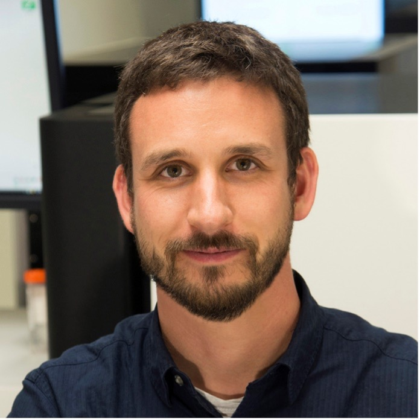
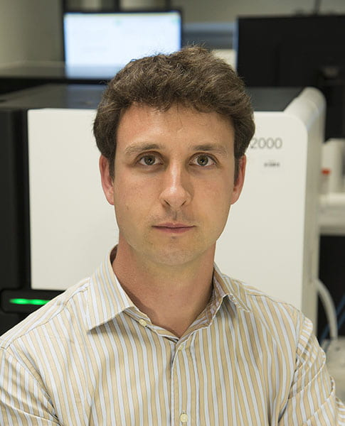
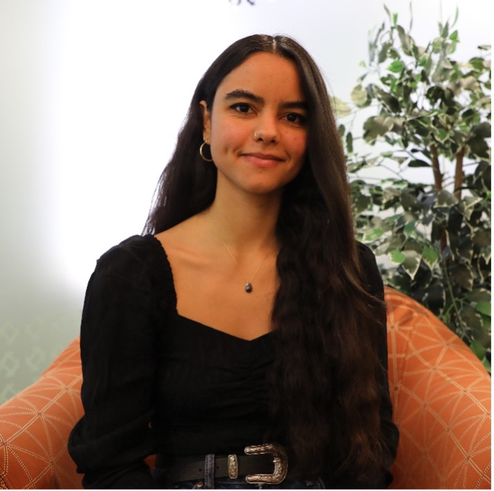
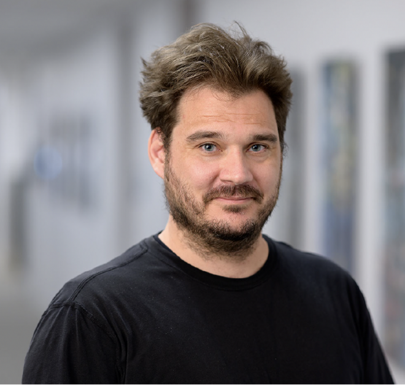
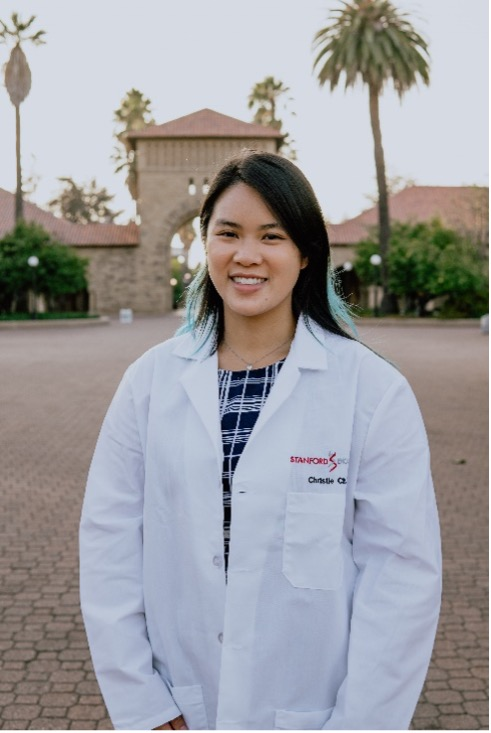
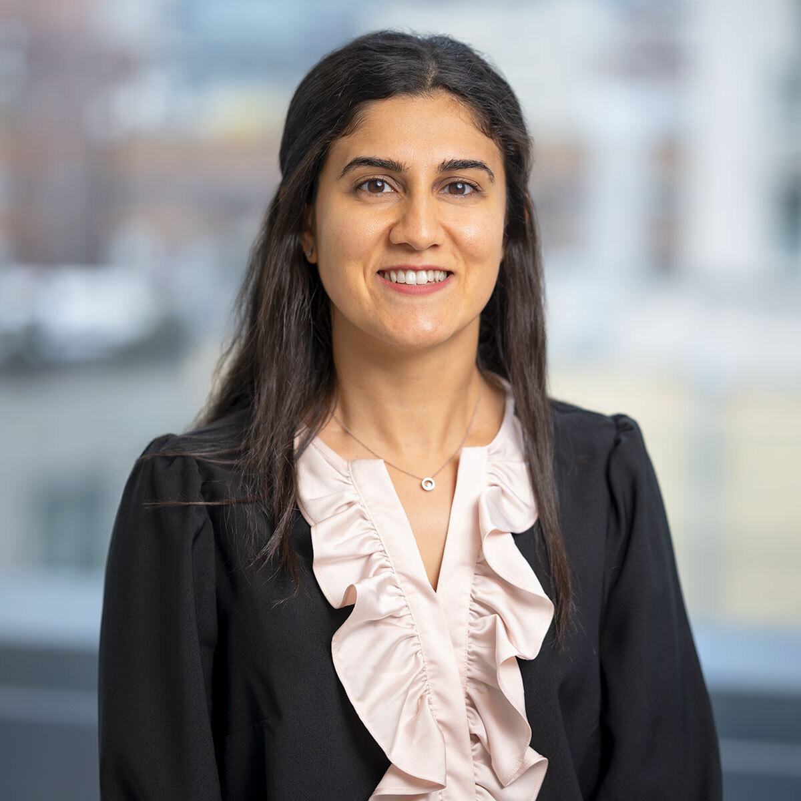
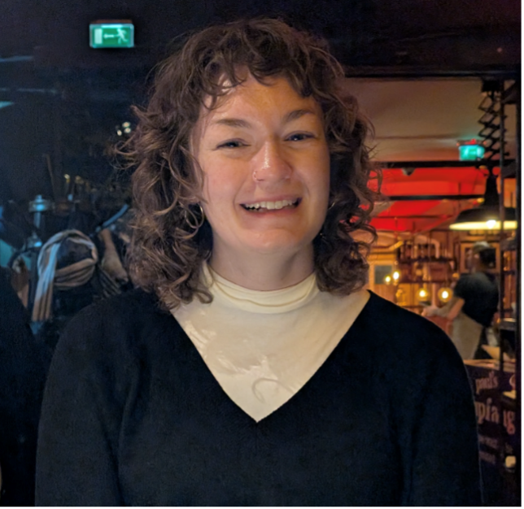
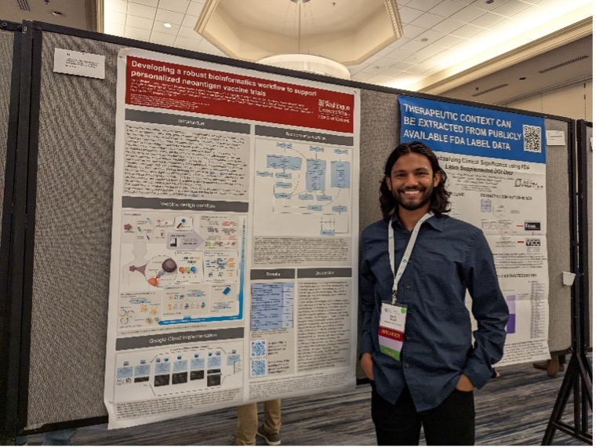

## Instructors

{width=4in fig-align="left"}

**Malachi Griffith, Ph.D.** is a Professor of Medicine (Division of Oncology), Professor of Genetics and Assistant Director of the McDonnell Genome Institute at Washington University. Dr. Griffith has more than 15 years of experience in the fields of genomics, bioinformatics, data mining, and cancer research. He has published over 130 studies, received numerous research awards and honors and held several large grants including an NIH NHGRI K99/R00 Career Development Award, an NCI ITCR U01 award, an NCI Biomedical Knowledgebase U24 award, and a V Scholar Award. He has mentored more than 50 bioinformatics trainees and taught more than 500 as an instructor for Cold Spring Harbor Laboratories and the Canadian Bioinformatics Workshops. Dr. Griffith’s research is focused on improving our understanding of cancer biology and the development of personalized medicine strategies for cancer using genomics and informatics technologies. Dr. Griffith is involved in more than ten investigator initiated clinical trials utilizing his lab’s tools for design of personalized neoantigen targeting immunotherapies. Dr. Griffith’s lab has made substantial contributions to open source and open access resources for cancer research. The development of bioinformatics methods and software for immunogenomics has become a major focus of his lab.

{width=4in fig-align="left"}

**Obi Griffith, Ph.D.** is a Professor of Medicine and Genetics at Washington University School of Medicine in St. Louis, where he also serves as Assistant Director at the McDonnell Genome Institute. His research focuses on developing personalized medicine strategies for cancer, utilizing genomic technologies to study gene regulatory changes, particularly in breast cancer. Dr. Griffith employs bioinformatics and statistical methods to analyze high-throughput sequencing data, aiming to identify biomarkers for diagnostics, prognosis, and drug response prediction. He co-developed the Clinical Interpretations of Variants in Cancer (CIViC), an open-source database that links cancer mutations to targeted therapies. Dr. Griffith completed his PhD in Medical Genetics at the University of British Columbia in 2008 and has held postdoctoral fellowships at the BC Cancer Agency and Lawrence Berkeley National Laboratory.
{width=4in fig-align="left"}

**Nataly Naser Al Deen, Ph.D.** is a Senior Computational Biologist at Memorial Sloan Kettering Cancer Center, where she leads spatial transcriptomics efforts (primarily Visium HD) in pre-malignant lesions, including ovarian cancer (serous tubal intraepithelial carcinoma, STIC) and gastric cancers (signet ring cell carcinoma, SRC). Trained as a wet-lab cancer researcher for a decade, she transitioned to computational oncology during her second postdoctoral fellowship (2022–2024) in cancer immunotherapy and melanoma at Dr. Antoni Ribas’ Lab at UCLA, focusing on spatial biology approaches to study tumor–immune interactions in patients treated with immune checkpoint blockade therapies. She previously completed a postdoctoral fellowship in cancer genomics at the Ding Lab at Washington University School of Medicine (WashU), where she led single-cell and single-nuclei RNA/ATAC sequencing, Visium spatial transcriptomics, and 3D light-sheet microscopy studies across breast, pancreatic, renal cell carcinoma, and metastatic colorectal cancers, and contributed to the HTAN, CPTAC, and SenNet consortia. She earned her Ph.D. in Cell and Molecular Biology from the American University of Beirut and received three fully funded scholarships from the U.S. Department of State, including a Fulbright Scholarship to Georgetown University (M.Sc. in Tumor Biology). In parallel, she is actively engaged in science policy, advocacy, and activism for minority and indigenous rights, and founded the NGO “Pink Steps” in 2015 to support the physical and mental well-being of breast cancer survivors in Lebanon, earning recognition on the Forbes 30 Under 30 list for her humanitarian work.

{width=4in fig-align="left"}

**Nicholas Ceglia, Ph.D.** is a principal computational biologist at Memorial Sloan Kettering Cancer Center in New York. He received his PhD in computer science from the University of California, Irvine. Currently, he leads the cellular phenotyping team that is part of the Shah Lab and the Computational Immuno-oncology initiative. His research focuses on the development of computational methods to understand co-evolution of cancer and the adaptive immune system.

{width=4in fig-align="left"}

**Katie Campbell, Ph.D.** is an Adjunct Assistant Professor at the University of California, Los Angeles (UCLA). Her research is at the intersection of cancer biology, immunology, and bioinformatics, integrating these methodologies to study how melanoma responds to immunotherapy. Leveraging high-dimensional spatial profiling and bulk sequencing modalities, her work aims to discover resistance mechanisms that stratify patients and inform the next generation of precision oncology strategies. Katie earned her undergraduate degree in biochemistry at the Penn State University and her PhD in molecular cell biology at Washington University in St. Louis. Her training, research, and career have been supported by NIH NCI T32 training programs at Washington University in St. Louis and UCLA, the Cancer Research Institute Irvington Postdoctoral Fellowship, the Gil Nickel Melanoma Research Fellowship through the V Foundation and UCLA Jonsson Comprehensive Cancer Center, the Parker Institute for Cancer Immunotherapy and V Foundation Bridge Fellowship, and the Melanoma Research Alliance-Ressler Family Fund Young Investigator Award. In addition to her research, Dr. Campbell is actively involved in mentorship and professional development, having served five years and elected Chair of the Associate Member Council of the American Association for Cancer Research (AACR), and research and patient advocacy, through the AACR and the Melanoma Research Foundation.

## Teaching Assistants

{width=4in fig-align="left"}

**Christie Chang** is a PhD student in the Immunology program at Stanford in the Satpathy Lab. She is currently optimizing immune cell-cell interaction labeling technology, focusing on dendritic cell and T cell interactions. Utilizing her background in computer science, genetics, and immunology, she hopes to better understand how dendritic cells can influence T cell activation and fate through the use of single-cell, high-dimensional assays and new technologies.

{width=4in fig-align="left"}

**Maryam Pourmaleki, Ph.D.** is a postdoctoral scholar at Stanford University. She received her Ph.D. in computational biology and medicine from the Tri-Institutional PhD Program at Weill Cornell Medicine, Memorial Sloan Kettering Cancer Center, and Rockefeller University in New York City. Her research is at the intersection of cancer immunobiology and computational biology. Over the years, Maryam has focused on identifying clinical biomarkers of treatment response, prognosis, and disease subtype across several cancers using spatial omics of human tumor biospecimens. Her work now aims to identify determinants of organotropism in colorectal cancer. Her training and research have been supported by NIH T32 training programs at Weill Cornell, an NIH F31 Predoctoral Fellowship, and currently, the Cancer Research Institute Immuno-Informatics Postdoctoral Fellowship in partnership with The Mark Foundation for Cancer Research.

{width=4in fig-align="left"}

**Evelyn Schmidt** is a first-year PhD trainee and beginning research in Dr. Jennifer Foltz’s lab, where she uses single-cell sequencing approaches to improve natural killer cell therapy for cancer. Before starting my PhD, Evelyn worked as a bioinformatician with Dr. Obi and Malachi Griffith, contributing to the lab’s neoantigen calling pipeline and the development of pVACtools.  She loves reading fantasy books, listening to all different types of music, and a good cup of coffee.

{width=4in fig-align="left"}

**Kartik Singhal** is a PhD student in the Molecular Genetics and Genomics program at Washington University in St Louis, USA. He is pursuing his thesis research in Malachi Griffith and Obi Griffith's lab where he is interested in using multi-omic techniques to better understand cancer's interaction with the immune system. He primarily analyzes single-cell omics data and works in R and Python for his analyses.

{width=4in fig-align="left"}

**Zachary Skidmore** is a quantitative scientist and bioinformatician, holding 10+ years of experience in the fields of bioinformatics and computational biology. His undergraduate work was completed at the Ohio State University and graduate level work completed at the University of Illinois. After graduation he started work at the McDonnell Genome Institute at Washington University in Saint Louis under the mentorship of Drs.Obi and Malachi Griffith. His research focus has traditionally been in the realm of cancer biology where he has used and developed tools and techniques to aid in the analysis and interpretation of sequencing data. Recently he has been focused on translational science using liquid biopsies.

